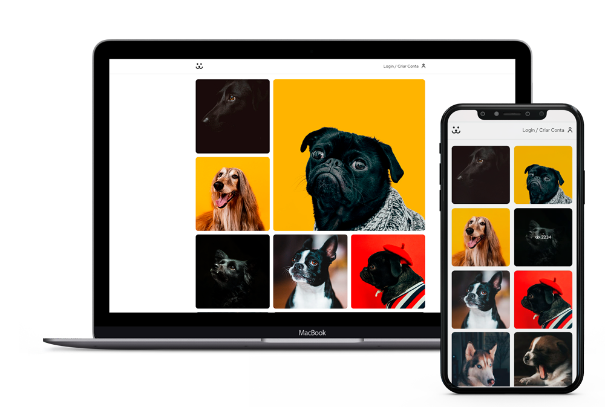

<div>
<h1 align="center">
   <b>Social Dogs</b>
  <br><br>
</h1>
<p align="center">Uma rede social boa pra cachorro</p><br>
</div>

<p align="center">
  <a href="http://makeapullrequest.com">
    
  </a>
  <a href="http://makeapullrequest.com">
    
  </a>
  <a href="https://saythanks.io/to/wendelfreitas">
      
  </a>
</p>

<p align="center">
 <a href="#sobre">Sobre</a> • 
 <a href="#instalacao">Instalação</a> • 
 <a href="#contribuicao">Contribuição</a> 
</p>

<p align="center">
  
</p>

# 💻 Sobre

Uma rede social para cachorros. <br>
Onde o usuário pode se cadastrar, fazer uploads das suas imagens e ter estatisticas do seu perfil e do quanto ele foi visualizado.<br>
Projeto realizado na conclusão do curso React Completo da escola Origamid. 💜<br><br>

# 🚀 Instalação

Para baixar o projeto siga as instruções abaixo:

```sh
git clone https://github.com/falaigor/social-dogs.git

cd social-dogs
```

Instale as dependências e inicie o projeto:

```sh
yarn install
yarn start
```

ou

```sh
npm install
npm start
```

# :handshake: Contribuição

<p>
Este projeto é para fins de estudo também, então me mande um e-mail me contando o que você está fazendo e por que está fazendo, me ensine o que você sabe.<br><br>
Todos as contribuições são muito bem-vindos e apreciadas!<br><br>

- ⭐️ Estrelinha no projeto
- 🐛 Encontre e reporte bugs
- 📥 Envie PRs para ajudar a resolver problemas ou adicionar recursos
- ✋ Influencie o futuro do Igor Santos com solicitações de recursos

</p>

Feito com 💜 by Igor Santos :wave:
